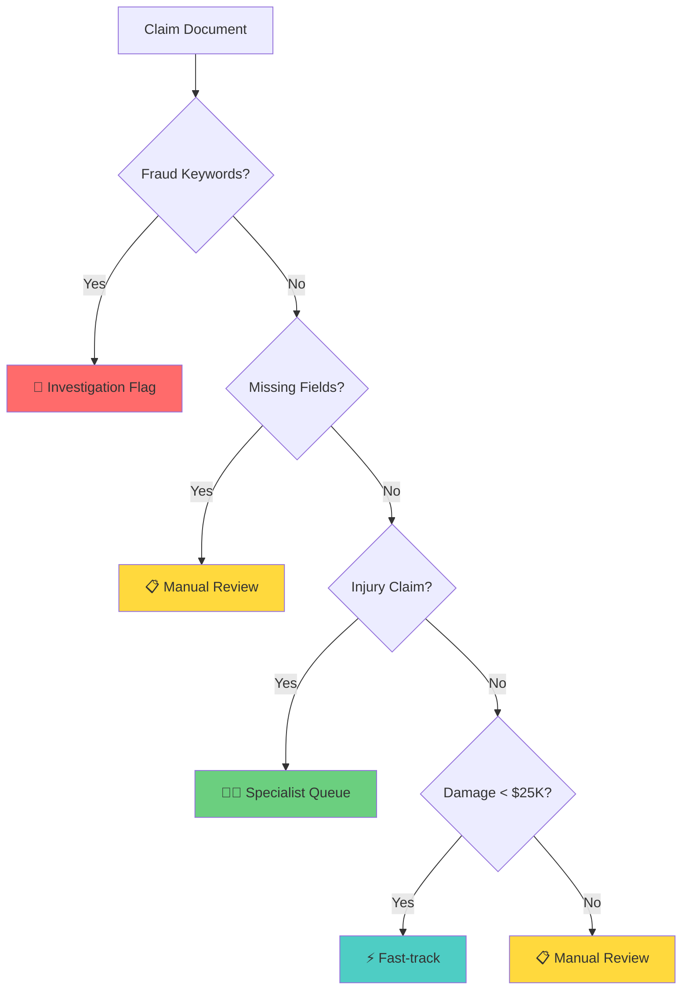

<div align="center">

# 🏥 Insurance Claims Processing Pipeline

### *Intelligent FNOL Document Processing & Automated Claim Routing*

[](https://www.python.org/downloads/)
[](LICENSE)
[](https://github.com/psf/black)

[Features](#-features) • [Quick Start](#-quick-start) • [How It Works](#-how-it-works) • [Demo](#-demo) • [Documentation](#-documentation)

</div>

---

## 📋 Overview

A **production-oriented prototype** that automates insurance claim processing by extracting key information from FNOL (First Notice of Loss) documents and intelligently routing claims based on deterministic business rules.

> **Built for**: Explainability, Auditability, and Maintainability  
> **Approach**: Rule-based extraction with prioritized routing logic  
> **Output**: Structured JSON with clear reasoning for every decision

<div align="center">

### 🎯 Core Capabilities

| Feature | Description |
|---------|-------------|
| 📄 **Smart Extraction** | Extracts 15+ fields from unstructured text using regex patterns |
| ✅ **Validation** | Identifies missing mandatory fields automatically |
| 🔀 **Intelligent Routing** | Applies prioritized business rules (Risk → Completeness → Specialization → Speed) |
| 💡 **Explainability** | Provides clear reasoning for every routing decision |
| 📊 **JSON Output** | Machine-readable, structured results |

</div>

---

## 🚀 Quick Start

### Installation

```bash
# Clone the repository
git clone https://github.com/MD-Abdul-Raheem/insurance-claims-processing.git
cd insurance-claims-processing

# No dependencies needed for TXT files!
# For PDF support (optional):
pip install PyPDF2
```

### Usage

<table>
<tr>
<td width="50%">

**Process Single Claim**
```bash
python claims_processor.py sample_claims/claim_fasttrack.txt
```

</td>
<td width="50%">

**Run All Tests**
```bash
python test_claims.py
```

</td>
</tr>
</table>

**Programmatic API**

```python
from claims_processor import process_claim

result = process_claim("path/to/claim.txt")
print(result)
```

---

## 🎬 Demo

### Input: FNOL Document
```text
Policy Number: POL-2024-001234
Policyholder Name: John Smith
Incident Date: 03/15/2024
Estimated Damage: $8,500.00
Claim Type: Property Damage
...
```

### Output: Structured JSON
```json
{
  "extractedFields": {
    "policy_number": "POL-2024-001234",
    "policyholder_name": "John Smith",
    "estimated_damage": 8500.0,
    "claim_type": "Property Damage"
  },
  "missingFields": [],
  "recommendedRoute": "Fast-track",
  "reasoning": "Estimated damage ($8,500.00) is below $25,000 threshold"
}
```

---

## 🧠 How It Works

### Routing Logic Priority

<div align="center">



</div>

### Priority Principle: **Risk → Completeness → Specialization → Speed**

| Priority | Rule | Trigger | Rationale |
|----------|------|---------|-----------|
| 🔴 **1** | Investigation Flag | Keywords: "fraud", "staged", "inconsistent" | Risk management overrides everything |
| 🟡 **2** | Manual Review | Any mandatory field missing | Incomplete data blocks automation |
| 🟢 **3** | Specialist Queue | Claim type contains "injury" | Medical expertise required regardless of value |
| 🔵 **4** | Fast-track | Estimated damage < $25,000 | Efficiency when risk/completeness satisfied |
| ⚪ **5** | Manual Review | High-value claims (≥ $25,000) | Conservative fallback |

> **Example**: A $4,500 injury claim routes to **Specialist Queue** (not Fast-track) because specialization trumps efficiency.

---

## 📊 Test Coverage

<div align="center">

| Test Case | Scenario | Expected Route | Status |
|-----------|----------|----------------|--------|
| `claim_fasttrack.txt` | $8,500 property damage | ⚡ Fast-track | ✅ |
| `claim_injury.txt` | $18,000 bodily injury | 👨‍⚕️ Specialist Queue | ✅ |
| `claim_conflict_case.txt` | $4,500 injury (conflict) | 👨‍⚕️ Specialist Queue | ✅ |
| `claim_fraud_flag.txt` | Fraud keywords detected | 🚨 Investigation Flag | ✅ |
| `claim_missing_fields.txt` | Missing claim_type | 📋 Manual Review | ✅ |
| `claim_high_value.txt` | $125,000 property damage | 📋 Manual Review | ✅ |

**6/6 Tests Passing** • Conflict resolution verified

</div>

---

## 📚 Documentation

### 🏗️ Design Decisions

#### 1. Rule-Based Extraction
- **Why**: Simple, transparent, and maintainable for junior developers
- **How**: Regex patterns match common FNOL document structures
- **Trade-off**: Less flexible than ML but more explainable and debuggable

#### 2. Deterministic Routing
- **Why**: Insurance routing must be consistent and auditable
- **How**: Rules applied in strict priority order
- **Trade-off**: Cannot learn from data but guarantees predictable behavior

#### 3. Minimal Dependencies
- **Why**: Easier deployment and fewer security vulnerabilities
- **How**: Uses only Python standard library for text processing
- **Trade-off**: PDF support requires optional external library

### 📋 Mandatory Fields

The following fields must be present for auto-processing:
- `policy_number`
- `policyholder_name`
- `incident_date`
- `incident_description` (required for fraud detection and routing logic)
- `claim_type`
- `estimated_damage`

**Note**: Some fields (e.g., `incident_description`) are elevated to mandatory due to routing dependencies.

### 📤 Output Format

```json
{
  "extractedFields": {
    "policy_number": "POL-2024-001234",
    "policyholder_name": "John Smith",
    "incident_date": "03/15/2024",
    "estimated_damage": 8500.0,
    "claim_type": "Property Damage",
    ...
  },
  "missingFields": [],
  "recommendedRoute": "Fast-track",
  "reasoning": "Estimated damage ($8,500.00) is below $25,000 threshold"
}
```

---

## ⚠️ Known Limitations

<details>
<summary><b>Current Limitations</b></summary>

<br>

1. **Document Format**
   - Only supports structured text with labeled fields
   - Requires consistent field naming (e.g., "Policy Number:", "Incident Date:")
   - PDF support requires additional library installation

2. **Extraction Accuracy**
   - Regex patterns assume standard formatting
   - Field extraction assumes reasonably consistent FNOL labels
   - Real-world deployments would require schema normalization or ML-assisted entity extraction
   - May fail on unusual date formats or field variations
   - Cannot handle handwritten or scanned documents without OCR

3. **Language Support**
   - English only
   - No support for multilingual documents

4. **Field Validation**
   - No semantic validation (e.g., date logic, policy number format)
   - No cross-field consistency checks

5. **Routing Logic**
   - Fixed rules cannot adapt to new patterns
   - No confidence scoring or uncertainty handling

</details>

---

## 🚀 Future Enhancements

<details>
<summary><b>Roadmap</b></summary>

<br>

### Short-term (Production Hardening)

1. **Enhanced Validation**
   - Date range validation (incident date within policy period)
   - Policy number format verification
   - Damage estimate reasonableness checks

2. **Better Error Handling**
   - Graceful degradation for partially readable documents
   - Detailed error logging and reporting

3. **Configuration**
   - Externalize routing rules to JSON/YAML config
   - Configurable mandatory fields per claim type
   - Adjustable damage threshold

### Medium-term (Scale)

1. **Batch Processing**
   - Process multiple claims in parallel
   - Generate summary reports
   - Database integration for claim tracking

2. **API Wrapper**
   - REST API for integration with other systems
   - Webhook support for async processing

3. **Document Preprocessing**
   - OCR integration for scanned documents
   - PDF text extraction with layout analysis
   - Image attachment processing

### Long-term (Intelligence)

1. **Machine Learning Enhancement**
   - NER (Named Entity Recognition) for field extraction
   - Classification models for claim type prediction
   - Anomaly detection for fraud indicators

2. **Adaptive Routing**
   - Learn optimal routing from historical outcomes
   - Confidence scoring for routing decisions
   - A/B testing framework for rule optimization

3. **Advanced Features**
   - Multi-language support
   - Real-time processing pipeline
   - Integration with external data sources (weather, traffic, etc.)

</details>

---

## 🧪 Testing

Run the test suite:

```bash
python test_claims.py
```

Expected output: 6 processed claims demonstrating all routing scenarios including conflict resolution.

---

## 📁 Project Structure

```
insurance-claims-processing/
├── 📄 claims_processor.py      # Main processing logic
├── 🧪 test_claims.py           # Test suite
├── 📖 README.md                # Documentation
├── 📦 requirements.txt         # Optional dependencies
└── 📂 sample_claims/           # Sample FNOL documents
    ├── claim_fasttrack.txt
    ├── claim_injury.txt
    ├── claim_conflict_case.txt
    ├── claim_fraud_flag.txt
    ├── claim_missing_fields.txt
    └── claim_high_value.txt
```

---

## 🏭 Production Readiness

**Status**: Production-oriented prototype

**For actual production deployment, add**:
- ✅ Comprehensive unit tests with edge case coverage
- 📝 Structured logging framework (e.g., Python logging module)
- 🔒 Input sanitization and schema validation
- 🛡️ Error handling with graceful degradation
- ⚙️ Configuration management (externalized rules)
- 🔄 CI/CD pipeline with automated testing

---

## 👨‍💻 Author

**MD Abdul Raheem**  
📧 [GitHub](https://github.com/MD-Abdul-Raheem) • 🔗 [LinkedIn](https://linkedin.com/in/md-abdul-raheem)

---

## 📄 License

Educational/Assignment Use Only

---

<div align="center">

**⭐ If you find this project useful, please consider giving it a star!**

Made with ❤️ for intelligent claims processing

</div>
